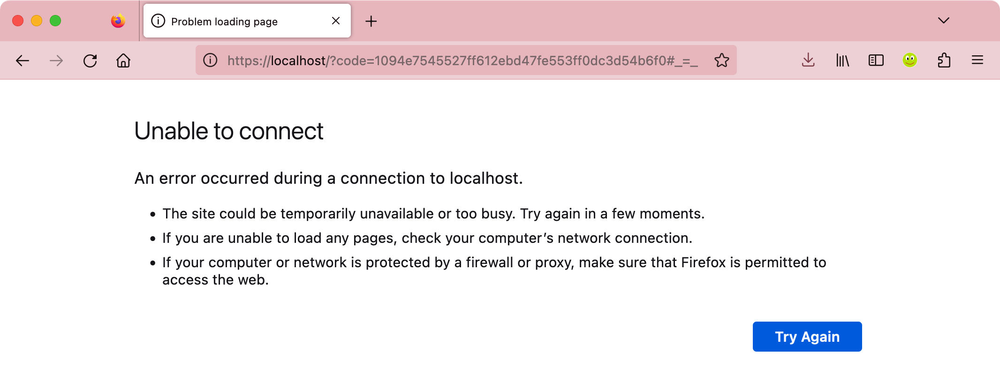

# Fitbit Web API sample script

This PowerShell script demonstrate how to execute [Fitbit](https://www.fitbit.com/) [Web API](https://dev.fitbit.com/build/reference/web-api/).

Fitbit Web API allows you to easily do tasks the official app does not support such as getting your lifetime distance or importing your weight data from CSV file.

## Prerequisites

You need to have your app registered in [developer page](https://dev.fitbit.com/apps) with your Fitbit account. Every registered app has been assigned a unique client id, which is needed to run the script. See official [Getting Started with the Fitbit APIs](https://dev.fitbit.com/build/reference/web-api/developer-guide/getting-started/) for details of registering apps.

Register your app with following details:。
* Redirect URL: https://localhost/
* [OAuth 2.0 Application Type](https://dev.fitbit.com/build/reference/web-api/developer-guide/application-design/#Application-Types): Personal

This PowerShell script needs PowerShell version 6.0 or above. Any older versions need to modify the script to work.。

## How to get an access token

HTTP requests to the Fitbit Web API require an access token which indicates it has been authorized. So the first thing you should do is to get your access token using `Get-FitbitWebApiToken` function here.

Include `Get-FitbitWebApiToken.ps1` file.

```PowerShell
. ./Get-FitbitWebApiToken.ps1
```

Execute `Get-FitbitWebApiToken` function with client id and scopes specified on the parameter. The client id should be replaced with your own one.

```PowerShell
$resp = Get-FitbitWebApiToken -ClientId 23R5JS -Scope activity, weight
```

[Scopes](https://dev.fitbit.com/build/reference/web-api/developer-guide/application-design/#Scopes) should be selected in relation to Web APIs you want to execute later. In this example, we select `activity` and `weight`.

Once executing `Get-FitbitWebApiToken` function, it displays the URL for authorization and pauses with an prompt.

```
PS > $resp = Get-FitbitWebApiToken -ClientId 23R5JS -Scope activity, weight
https://www.fitbit.com/oauth2/authorize?client_id=23R5JS&response_type=code&code_challenge=49GxnPpygtcSX-TArUxbiINsUKWqeS8B6np2H2hqDsA&code_challenge_method=S256&scope=activity%20weight

1. Open the above URL in a browser.
2. Authorize the application (login may be needed).
3. Copy the code from the URL of the page you are redirected to.

Enter the code from the URL: 
```

Open the URL with your browser and authorize the app to access the data.


After authorization the browser is redirected to the app's redirect URL. In this case it results an error because we specify `https://localhost/` which is not hosted by any web server. But no problem we need only `code` parameter in the redirected URL.


Copy a value of `code` parameter (or entire URL) and enter it on the prompt which `get-FitbitWebApiToken` function has displayed.

```
Enter the code from the URL: 1094e7545527ff612ebd47fe553ff0dc3d54b6f0
```

Then `Get-FitbitWebApiToken` resumes the process, sends `code` to the Token endpoint to receive an access token and exits with the token as return value.

You can find the access token from `$resp` variable.

```
PS> $resp

access_token  : eyJhbGciOiJIUzI1NiJ9.eyJhdWQiOiIyM1I1SlMiLCJzdWIiOiI5SkxUV1giLCJpc3MiOiJGaXRiaXQiLC
                J0eXAiOiJhY2Nlc3NfdG9rZW4iLCJzY29wZXMiOiJ3YWN0IHd3ZWkiLCJleHAiOjE2OTIwODY5MjksImlhd
                CI6MTY5MjA1ODEyOX0.gVWbqp1-VCdfwJUgtfWgBKaf_RQ83CmPUiuilZ4pFSU
expires_in    : 28800
refresh_token : ee9d0e7b15d1eb582eb51b19925a42011ac41f11e7aacd879e437cf89cc366f5
scope         : weight activity
token_type    : Bearer
user_id       : 9JLTWX


PS> 
```

## How to run Web APIs

You can run Web APIs using previously retrieved access token as Bearer.

Because PowerShell cmdlets accepts tokens whose type is `[SeucreString]` only, convert from `[String]` and keep it in `$token` variable.

```PowerShell
$token = ConvertTo-SecureString -AsPlainText $resp.access_token
```

Using [Get Lifetime Stats](https://dev.fitbit.com/build/reference/web-api/activity/get-lifetime-stats/):

```PowerShell
$stats = Invoke-RestMethod -Uri https://api.fitbit.com/1/user/-/activities.json -Authentication Bearer -Token $token
```

You can find the distance you have moved so far from the response.

```
PS> $stats = Invoke-RestMethod -Uri https://api.fitbit.com/1/user/-/activities.json -Authentication Bearer -Token $token
PS> $stats.lifetime.total

activeScore caloriesOut distance   steps
----------- ----------- --------   -----
         -1          -1 2697.300 3438655

PS>
```

Using [Create Weight Log](https://dev.fitbit.com/build/reference/web-api/body/create-weight-log/) and [Create Body Fat Log](https://dev.fitbit.com/build/reference/web-api/body/create-bodyfat-log/) to import weight and fat data from local CSV file.

```PowerShell
Import-Csv -Path ./data.csv |
ForEach-Object -Process {
  $datetime = [datetime]$_.datetime
  $date = $datetime.ToString('yyyy-MM-dd')
  $time = $datetime.ToString('HH:mm:ss')
  $weight = $_.weight
  $fat = $_.fat

  $resp1 = Invoke-RestMethod -Method Post -Uri https://api.fitbit.com/1/user/-/body/log/weight.json -Authentication Bearer -Token $token -Body @{ weight=$weight; date=$date; time=$time }

  $resp2 = Invoke-RestMethod -Method Post -Uri https://api.fitbit.com/1/user/-/body/log/fat.json -Authentication Bearer -Token $token -Body @{ fat=$fat; date=$date; time=$time }
}
```