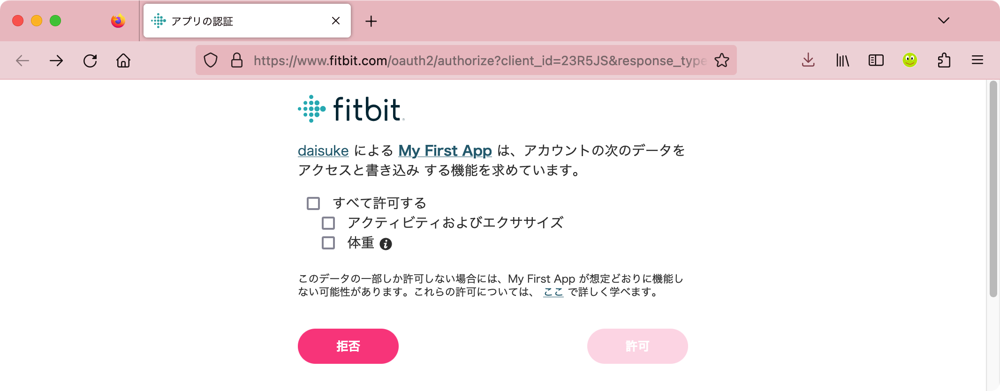
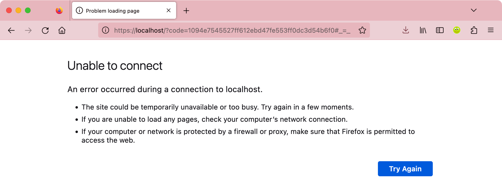

# Fitbit Web API のサンプルスクリプト

この PowerShell スクリプトは、[Fitbit](https://www.fitbit.com/) の [Web API](https://dev.fitbit.com/build/reference/web-api/) を実行する例を示します。

Fitbit Web API を使うことによって、累計移動距離を取得する、または CSV ファイルの体重データを Fitbit にインポートするなど、標準のアプリ機能だけでは難しいことが容易になります。

## 前提条件

Web API を使うアプリが開発者の Fitbit アカウントの [開発者ページ](https://dev.fitbit.com/apps) にあらかじめ登録されている必要があります。登録されたアプリにはクライアント ID と呼ばれる識別情報が自動付与され、それがスクリプトの実行に必要となるためです。アプリの登録については、公式ドキュメントの [Getting Started with the Fitbit APIs](https://dev.fitbit.com/build/reference/web-api/developer-guide/getting-started/) も参照してください。

アプリを登録する際、次の内容で登録します。
* リダイレクト先 URL: https://localhost/
* [アプリケーションタイプ](https://dev.fitbit.com/build/reference/web-api/developer-guide/application-design/#Application-Types): Personal

また、このスクリプトは PowerShell 6.0 以上を前提にしています。それより前の環境ではスクリプトの修正が必要になります。

## 使いかた (アクセストークンの取得)

Fitbit Web API を呼び出す HTTP リクエストには、適切な認可が与えられたことを示すアクセストークンを含む必要があります。そのため、最初に `Get-FitbitWebApiToken` 関数を使ってアクセストークンを取得します。

`Get-FitbitWebApiToken.ps1` ファイルをインクルードします。

```PowerShell
. ./Get-FitbitWebApiToken.ps1
```

アプリのクライアント ID とスコープを引数にして `Get-FitbitWebApiToken` 関数を実行します。クライアント ID は自分のアプリのものに置き換えてください。

```PowerShell
$resp = Get-FitbitWebApiToken -ClientId 23R5JS -Scope activity, weight
```

[スコープ](https://dev.fitbit.com/build/reference/web-api/developer-guide/application-design/#Scopes) は、後で実行する Web API に応じて適切なものを選択する必要があります。ここでは、活動や運動のデータに関する `activity` と体重や体脂肪率のデータに関する `weight` を選択しています。

`Get-FitbitWebApiToken` 関数を実行すると、次のように認可画面の URL とプロンプトが表示され、一時停止します。

```
PS > $resp = Get-FitbitWebApiToken -ClientId 23R5JS -Scope activity, weight
https://www.fitbit.com/oauth2/authorize?client_id=23R5JS&response_type=code&code_challenge=49GxnPpygtcSX-TArUxbiINsUKWqeS8B6np2H2hqDsA&code_challenge_method=S256&scope=activity%20weight

1. Open the above URL in a browser.
2. Authorize the application (login may be needed).
3. Copy the code from the URL of the page you are redirected to.

Enter the code from the URL: 
```

表示された URL をブラウザーで開き、ブラウザー上でアプリに対してデータへのアクセスを求められるため、許可します。


許可をするとブラウザーはアプリのリダイレクト先の URL に遷移します。今回の場合リダイレクト先 URL に指定した `https://localhost/` には Web サーバーが存在しないためエラーになりますが、必要なものはリダイレクト先 URL に追加された `code` パラメーターであるため、問題はありません。


リダイレクト先の URL に含まれる `code` パラメーターの値 (または URL 全体) をコピーして、`Get-FitbitWebApiToken` 関数が表示しているプロンプトに入力します。

```
Enter the code from the URL: 1094e7545527ff612ebd47fe553ff0dc3d54b6f0
```

その後 `Get-FitbitWebApiToken` 関数は処理を再開して Token エンドポイントに `code` を送信し、それと引き換えにしてアクセストークンを取得し、それを呼び出し元に返して処理を終了します。

今回の例の場合、関数の戻り値を `$resp` 変数に格納しているため、そのプロパティを調べてアクセストークンが含まれていることがわかります。

```
PS> $resp

access_token  : eyJhbGciOiJIUzI1NiJ9.eyJhdWQiOiIyM1I1SlMiLCJzdWIiOiI5SkxUV1giLCJpc3MiOiJGaXRiaXQiLC
                J0eXAiOiJhY2Nlc3NfdG9rZW4iLCJzY29wZXMiOiJ3YWN0IHd3ZWkiLCJleHAiOjE2OTIwODY5MjksImlhd
                CI6MTY5MjA1ODEyOX0.gVWbqp1-VCdfwJUgtfWgBKaf_RQ83CmPUiuilZ4pFSU
expires_in    : 28800
refresh_token : ee9d0e7b15d1eb582eb51b19925a42011ac41f11e7aacd879e437cf89cc366f5
scope         : weight activity
token_type    : Bearer
user_id       : 9JLTWX


PS> 
```

## 使いかた (Web API の実行)

取得したアクセストークンを Bearer として使って、Web API を実行することができます。

PowerShell のコマンドレットではトークンが `[SecureString]` 型でないと受け付けられないため、`[String]` から変換したものを `$token` 変数に保持します。

```PowerShell
$token = ConvertTo-SecureString -AsPlainText $resp.access_token
```

次は [Get Lifetime Stats](https://dev.fitbit.com/build/reference/web-api/activity/get-lifetime-stats/) を使う例です。

```PowerShell
$stats = Invoke-RestMethod -Uri https://api.fitbit.com/1/user/-/activities.json -Authentication Bearer -Token $token
```

実行結果からこれまでの累計移動距離を表示する例です。

```
PS> $stats = Invoke-RestMethod -Uri https://api.fitbit.com/1/user/-/activities.json -Authentication Bearer -Token $token
PS> $stats.lifetime.total

activeScore caloriesOut distance   steps
----------- ----------- --------   -----
         -1          -1 2697.300 3438655

PS>
```

次は [Create Weight Log](https://dev.fitbit.com/build/reference/web-api/body/create-weight-log/) と [Create Body Fat Log](https://dev.fitbit.com/build/reference/web-api/body/create-bodyfat-log/) を使って、ローカルの CSV に格納された体重と体脂肪率のデータを Fitbit に登録する例です。

```PowerShell
Import-Csv -Path ./data.csv |
ForEach-Object -Process {
  $datetime = [datetime]$_.datetime
  $date = $datetime.ToString('yyyy-MM-dd')
  $time = $datetime.ToString('HH:mm:ss')
  $weight = $_.weight
  $fat = $_.fat

  $resp1 = Invoke-RestMethod -Method Post -Uri https://api.fitbit.com/1/user/-/body/log/weight.json -Authentication Bearer -Token $token -Body @{ weight=$weight; date=$date; time=$time }

  $resp2 = Invoke-RestMethod -Method Post -Uri https://api.fitbit.com/1/user/-/body/log/fat.json -Authentication Bearer -Token $token -Body @{ fat=$fat; date=$date; time=$time }
}
```